<!--
emoji：https://emoji.muan.co/
icon: https://simpleicons.org/
-->
<picture decoding="async" loading="lazy">
  <source media="(prefers-color-scheme: light)" srcset="https://pixel-profile.vercel.app/api/github-stats?username=Mnting&theme=journey>
  <source media="(prefers-color-scheme: dark)" srcset="https://pixel-profile.vercel.app/api/github-stats?username=Mnting&theme=journey&screen_effect=true">
  
</picture>

---

## Mnting（跳跳虎） 👨‍💻

### 两只狗狗的饲养员 关于 | About

- **像是撒出耕田落到道边儿的麦子，疯长，抽条，不结一点儿穗儿，简直像狗尾巴草。风一吹了比谁都招摇，招摇得生动，招摇得漂亮，活的。会被人问这是麦子吗，麦子能长成这样吗，麦子长成这样好看吗，麦子长成这样有用吗。 他不管你，就这么在道边儿自己长自己的玩儿去，满不在乎又清醒地长。很舒服的感觉。** 

---

### 🛠 技术栈(学习时间线) | Tech Stack(Learning timeline)

- 2023🐬 &#160;
  
  
  

- 2022😄 &#160;
  
  
  
  

- 2021🚀 &#160;
  
  
  
  
  
  
  
  
  
  
  
- 2020⚡️ &#160; 
  
  
  
  
  
  
  
- 2019💻 &#160;
  
  
  
  
  
  
  
  
  
  
  
  
  
  
  
- 2018🛢 &#160; 
  
  
  
  
  
  
  
  
  
  
  
  
  
  
  
  
  
- 2016🌱 &#160;
  
  
  
  
  
  
  
  
  
  

> 只记录了我有实际接触使用的技能/框架。忽略小框架/小技能。

<!-- 
 -->
